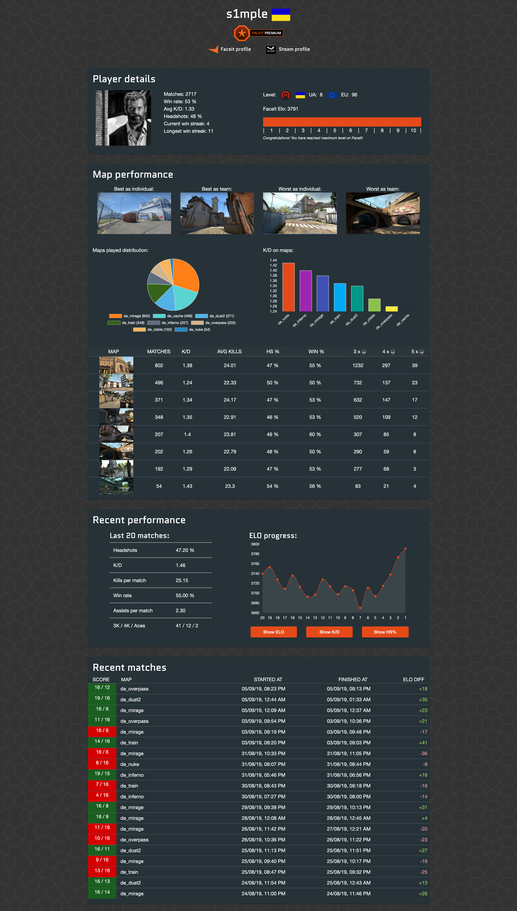

# Tuscan-frontend
[](https://travis-ci.com/przbetkier/tuscan-frontend)

[Tuscan.pro](https://tuscan.pro) is an open-source project using Faceit API for presentation and analysis of recent and overall CS:GO players performance during Faceit matches.
Here you can find source code of its frontend layer.

## Features:

- Player details: presents basic information about the player - elo, k/d, country, etc
- Map performance: displays how player performs on particular maps in active map pool and points out weaknesses and strengths
- Recent performance: this section will tell you how subjected player performed during last 20 matches. Here you can find graphs with elo, k/d and HS progress throughout these games.
- Recent matches: will allow you quickly (and without any page reloads) look through recent matches and check performance of any player in the match. On the right you can see number of points gained/lost after this game.



### Development:

1. Go to related project [Tuscan](https://github.com/przbetkier/tuscan) and set up it locally
2. Now you can clone this tuscan-frontend repo and simply run default Angular 8 commands:

```
npm install
ng build
ng serve
```

All contributions are welcome.

### Related projects:

- [tuscan](https://github.com/przbetkier/tuscan) - Java backend service providing player details using FACEIT API.
- [faceit-lobby-extension-chrome](https://github.com/przbetkier/faceit-lobby-extension-chrome) - Google Chrome extension which helps during map picking on Faceit CS:GO matches.
